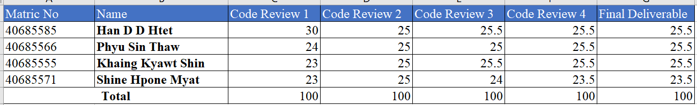

# Group 4 - DevOps

## Badges
Workflow

Build Status for develop

Build Status for master

Code coverage of tests for master

LICENSE

Release

## Sprint 1

Project set-up and product Backlog created.  
project build to self-contained JAR with Maven and create Dockerfile.  
Create GitHub Actions and build is working using JAR, and Docker.  
Create master, develop, and release branches.  
First release created on GitHub.  
Define Code of Conduct.  

## Sprint 2

Issues and user stories are created.  
Assigned user, separate tasks and add sprint for issues.  
Create queries for generating reports in feature/ branches.  
Full use cases are created.  
Use case diagram is created.  

## Sprint 3

Unit tests for finished reports are added.  
Integration tests for finished reports are added.

## Sprint 4

Deployment is performed.  
Bug reporting is set up.  
Creating queries(23-25) for generating reports.  
Adding unit tests for queries(23-25).  
Adding integration tests for queries(23-25).

## Sprint 5

Creating queries(26-32) for generating reports.  
Adding unit tests for queries(26-32).  
Adding integration tests for queries(26-32).  
Adding Badges in Main Repository Readme.  
Adding detailed requirements table.  
Implementing final delivery and other requirements for the system.

## Resource Link
You can view our project progress and step by step tasks performed due to the following site: 

Github: https://github.com/Han-D-D-Htet/Group4-DevOps

Zube(Kanban Board): https://zube.io/group4_devops/group4/w/workspace-1/sprints  
(Note: All defined tasks are done and sprints are closed so they can be viewed in the closed tab)

## Bug Report
For reporting bug, we create reports by using both issue template and issue form to describe details for each issue. Bug reports can be seen at GitHub issues.

## Showing query outputs that meet the Requirements

| ID | Name                                                                                                                                                                 |  Met   |                             Screenshot |
|:---|:---------------------------------------------------------------------------------------------------------------------------------------------------------------------|:------:|---------------------------------------:|
| 1  | All the countries in the world organised by largest population to smallest.                                                                                          |  Yes   |        |
| 2  | All the countries in a continent organised by largest population to smallest.                                                                                        |  Yes   |    |
| 3  | All the countries in a region organised by largest population to smallest.                                                                                           |  Yes   |    |
| 4  | The top N populated countries in the world where N is provided by the user.                                                                                          |  Yes   |    |
| 5  | The top N populated countries in a continent where N is provided by the user.                                                                                        |  Yes   |    |
| 6  | The top N populated countries in a region where N is provided by the user.                                                                                           |  Yes   |    |
| 7  | All the cities in the world organised by largest population to smallest.                                                                                             |  Yes   |    |
| 8  | All the cities in a continent organised by largest population to smallest.                                                                                           |  Yes   |    |
| 9  | All the cities in a region organised by largest population to smallest.                                                                                              |  Yes   |    |
| 10 | All the cities in a country organised by largest population to smallest.                                                                                             |  Yes   |    |
| 11 | All the cities in a district organised by largest population to smallest.                                                                                            |  Yes   |  |
| 12 | The top N populated cities in the world where N is provided by the user.                                                                                             |  Yes   |  |
| 13 | The top N populated cities in a continent where N is provided by the user.                                                                                           |  Yes   |  |
| 14 | The top N populated cities in a region where N is provided by the user.                                                                                              |  Yes   |  |
| 15 | The top N populated cities in a country where N is provided by the user.                                                                                             |  Yes   |  |
| 16 | The top N populated cities in a district where N is provided by the user.                                                                                            |  Yes   |  |
| 17 | All the capital cities in the world organised by largest population to smallest.                                                                                     |  Yes   |  |
| 18 | All the capital cities in a continent organised by largest population to smallest.                                                                                   |  Yes   |  |
| 19 | All the capital cities in a region organised by largest to smallest.                                                                                                 |  Yes   |  |
| 20 | The top N populated capital cities in the world where N is provided by the user.                                                                                     |  Yes   |  |
| 21 | The top N populated capital cities in a continent where N is provided by the user.                                                                                   |  Yes   |  |
| 22 | The top N populated capital cities in a region where N is provided by the user.                                                                                      |  Yes   |  |
| 23 | The population of people, people living in cities, and people not living in cities in each continent.                                                                |  Yes   |  |
| 24 | The population of people, people living in cities, and people not living in cities in each region.                                                                   |  Yes   |  |
| 25 | The population of people, people living in cities, and people not living in cities in each country.                                                                  |  Yes   |  |
| 26 | The population of the world.                                                                                                                                         |  Yes   |  |
| 27 | The population of the continent.                                                                                                                                     |  Yes   |  |
| 28 | The population of the region.                                                                                                                                        |  Yes   |  |
| 29 | The population of the country.                                                                                                                                       |  Yes   |  |
| 30 | The population of the district.                                                                                                                                      |  Yes   |  |
| 31 | The population of the city.                                                                                                                                          |  Yes   |  |
| 32 | Number of people who speak Chinese, English, Hindi, Spanish and Arabic languages from greatest number to smallest, including the percentage of the world population. |  Yes   |  |

## Contribution Marks
